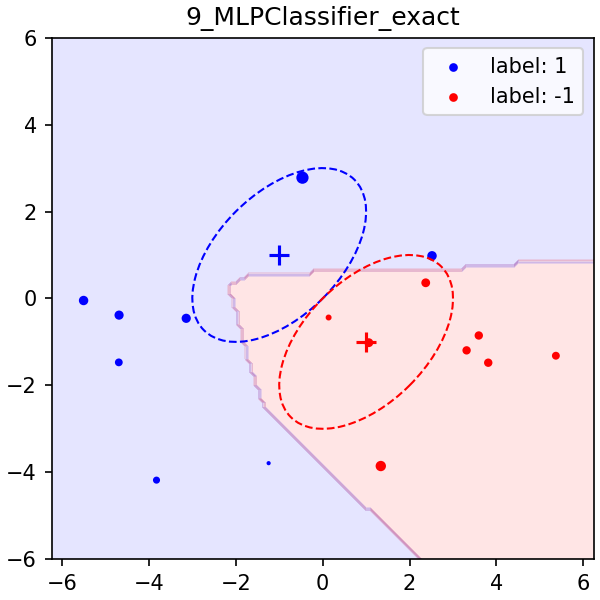
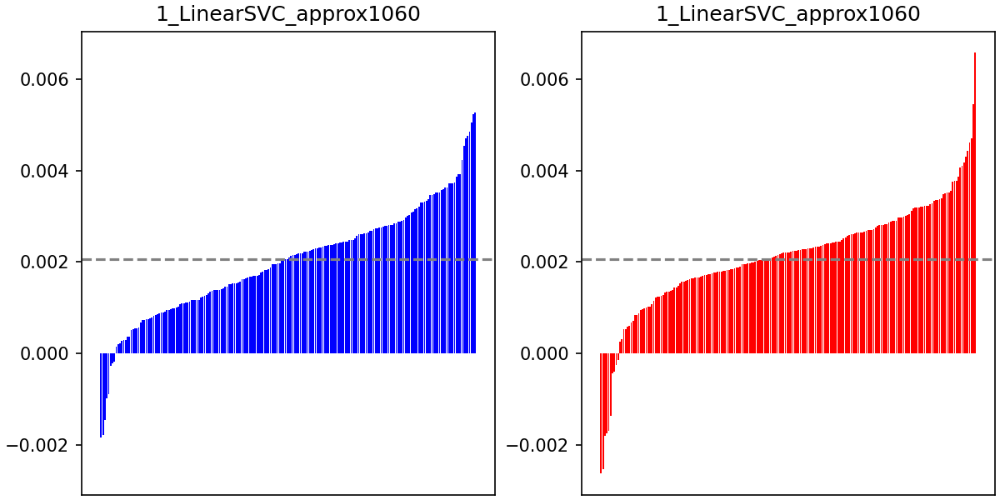

# COS598 - Final Project
## Results of `experiment1`

### Setup
- Dataset
    - Gaussian 1: $\mu_1 = \begin{pmatrix}1 \\ -1\end{pmatrix}$ and $\Sigma_1 = V_1 \Lambda_1 V_1^T$ with $\Lambda_1 = \begin{pmatrix}3 & 0 \\ 0 & 1\end{pmatrix}$ and $V_1 = \begin{pmatrix}1 & 1 \\ 1 & -1\end{pmatrix}$
    - Gaussian 2: $\mu_2 = \begin{pmatrix}-1 \\ 1\end{pmatrix}$ and $\Sigma_2 = V_2 \Lambda_2 V_2^T$ with $\Lambda_2 = \begin{pmatrix}3 & 0 \\ 0 & 1\end{pmatrix}$ and $V_2 = \begin{pmatrix}1 & 1 \\ 1 & -1\end{pmatrix}$
- Models
    - LogisticRegression (LR)
    - LinearSVC (SVC_lin)
    - SVC with RBF kernel (SVC_rbf)
    - MLPClassifier with (10, 10) layers (MLP)

### Exact Shapley values

\#| \| |size train|size test|num perm|seed| \| |size total|num eval| \| |LR|SVC_lin|SVC_rbf|MLP
-| - |-|-|-|-| - |-|-| - |-|-|-|-
3_size6_exact| \| |6|100|None|**0**| \| |12|50K| \| |0.8150 / 00:12|0.8150 / 00:05|0.5800 / 00:03|0.6900 / 00:47
3_size6_exact| \| |6|100|None|**1**| \| |12|50K| \| |0.7950 / 00:12|0.8150 / 00:05|0.7150 / 00:03|0.8100 / 00:29
3_size6_exact| \| |6|100|None|**2**| \| |12|50K| \| |0.8950 / 00:12|0.8950 / 00:05|0.6450 / 00:03|0.6300 / 01:21
4_size8_exact| \| |8|100|None|**0**| \| |16|1M| \| |0.7900 / 03:16|0.8050 / 01:33|0.6450 / 01:01|0.6850 / 09:17
4_size8_exact| \| |8|100|None|**1**| \| |16|1M| \| |0.8450 / 03:13|0.8650 / 01:35|0.7450 / 01:01|0.7450 / 12:58
4_size8_exact| \| |8|100|None|**2**| \| |16|1M| \| |0.8400 / 03:20|0.8500 / 01:37|0.8500 / 01:01|0.6850 / 18:17
1_size10_exact| \| |10|100|None|**0**| \| |20|20M| \| |0.7100 / 52:57|0.7700 / 29:42|0.5900 / 17:05|0.6750 / 4:37:11
1_size10_exact| \| |10|100|None|**1**| \| |20|20M| \| |0.8650 / 54:09|0.8650 / 26:38|0.7500 / 17:36|0.7650 / 4:06:41
1_size10_exact| \| |10|100|None|**2**| \| |20|20M| \| |0.8550 / 56:53|0.8750 / 25:11|0.8500 / 18:00|0.8450 / 7:11:52

#### GaussianExperiment_3_size6_exact
##### seed 0

##### seed 1

##### seed 2

#### GaussianExperiment_4_size8_exact
##### seed 0

##### seed 1

##### seed 2

#### GaussianExperiment_1_size10_exact
##### seed 0

##### seed 1

##### seed 2

#### Hypothesis
- **LogisticRegression, LinearSVC**: Shapley values distributed more linearly (i.e. model performance "supported" by few important data points)
- **SVC_rbf**: Shapley values distributed more homogeneously (i.e. model performance "supported" by multiple data points)
- **MLPClassifier**: Shapley values distributed more homogeneously, but bad data points with much smaller Shapley values (i.e. model performance sensitive by bad data points)

---------------------------------------

### Approximate Shapley values

\#| \| |size train|size test|num perm|seed| \| |size total|num eval| \| |LR|SVC_lin|SVC_rbf|MLP
-| - |-|-|-|-| - |-|-| - |-|-|-|-
2_size100_approx| \| |100|1000|**200**|0| \| |200|40K| \| |0.8230 / 03:24|0.8245 / 02:10|0.7820 / 07:54|0.7795 / 1:04:41
2_size100_approx| \| |100|1000|**400**|0| \| |200|80K| \| |0.8230 / 06:17|0.8245 / 04:03|0.7820 / 14:52|0.7795 / 2:12:20
2_size100_approx| \| |100|1000|**600**|0| \| |200|120K| \| |0.8230 / 09:22|0.8245 / 06:01|0.7820 / 23:36|0.7795 / 3:27:55
5_size100_200_approx| \| |**100**|1000|**460**|0| \| |200|92K| \| |0.8230 / 05:25|0.8245 / 03:56|0.7820 / 15:37|0.7795 / 2:08:54
5_size100_200_approx| \| |**200**|1000|**1060**|0| \| |400|424K| \| |0.8285 / 33:21|0.8275 / 25:54|0.8105 / 2:18:18|0.7935 / 12:16:08
6_size400_approx| \| |**400**|1000|**2400**|0| \| |800|960K| \| |0.8265 / 2:45:50|0.8260 / 2:42:17|0.8180 / 20:02:37|0.8260 / 61:17:28

#### GaussianExperiment_2_size100_approx
##### 200 permutations

##### 400 permutations

##### 600 permutations

#### GaussianExperiment_5_size100_200_approx
##### size: 100, permutations: 460

##### size: 200, permutations: 1060

##### size: 400, permutations: 2400

