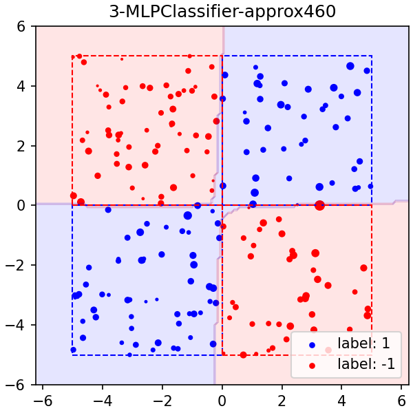
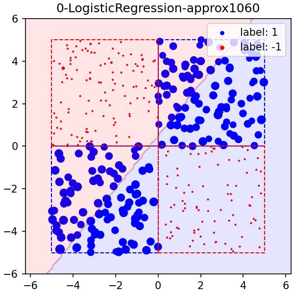

# COS598 - Final Project
## Results of `uniform_experimentA1`

### Setup
- Dataset
    - Uniform 1: $([-5,0] \times [-5,0]) \cup ([0,5] \times [0,5])$
    - Uniform 2: $([-5,0] \times [0,5]) \cup ([0,5] \times [-5,0])$
- Models
    - LogisticRegression (LR)
    - LinearSVC (SVC_lin)
    - SVC with RBF kernel (SVC_rbf)
    - MLPClassifier with (10, 10) layers (MLP)

### Hypothesis
TBD

### Approximate Shapley values

\#| \| |size train|size test|num perm|seed| \| |size total|num eval| \| |LR|SVC_lin|SVC_rbf|MLP
-| - |-|-|-|-| - |-|-| - |-|-|-|-
1-size100_approx| \| |**100**|1000|**460**|0| \| |200|92K| \| |0.5245 / 06:35|0.5245 / 05:05|0.9556 / 16:54|0.9765 / 44:29
2-size200_approx| \| |**200**|1000|**1060**|0| \| |400|424K| \| |0.5470 / 31:39|0.5470 / 27:13|0.9750 / 1:52:35|0.9900 / 4:47:59
3-size400_approx| \| |**400**|1000|**2400**|0| \| |800|2M| \| |0.5420 / 2:31:26|0.5420 / 2:43:41|0.9850 / 11:32:05|0.9960 / 15:23:34

#### UniformExperimentA-1-size100_approx

#### UniformExperimentA-2-size200_approx

#### UniformExperimentA-3-size400_approx

