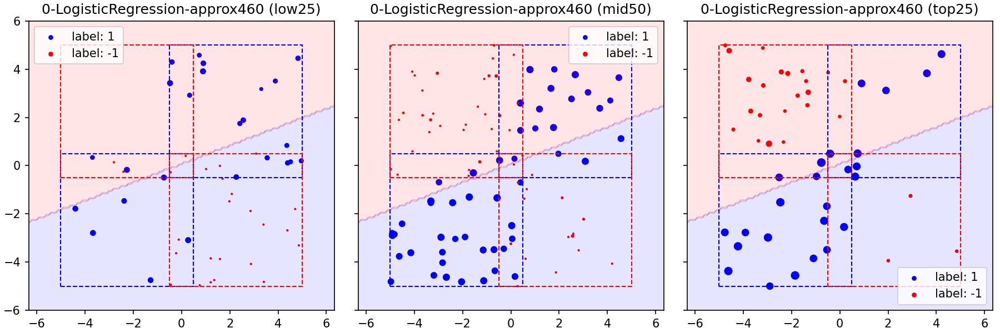
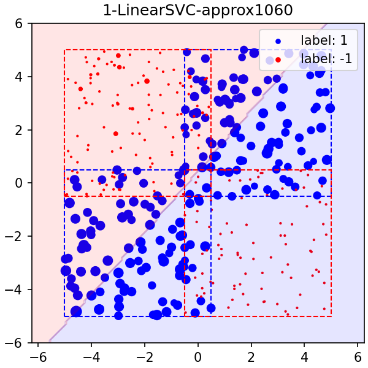
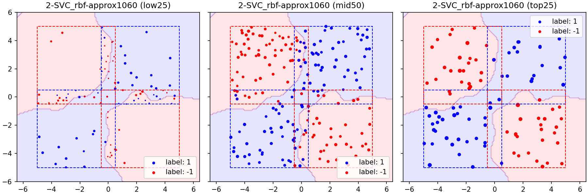

# COS598 - Final Project
## Results of `uniform_experimentA2`

### Setup
- Dataset
    - Uniform 1: $([-5,0.5] \times [-5,0.5]) \cup ([-0.5,5] \times [-0.5,5])$
    - Uniform 2: $([-5,0.5] \times [-0.5,5]) \cup ([-0.5,5] \times [-5,0.5])$
- Models
    - LogisticRegression (LR)
    - LinearSVC (SVC_lin)
    - SVC with RBF kernel (SVC_rbf)
    - MLPClassifier with (10, 10) layers (MLP)

### Hypothesis
TBD

### Approximate Shapley values

\#| \| |size train|size test|num perm|seed| \| |size total|num eval| \| |LR|SVC_lin|SVC_rbf|MLP
-| - |-|-|-|-| - |-|-| - |-|-|-|-
1-size100_approx| \| |**100**|1000|**460**|0| \| |200|92K| \| |0.5115 / 06:33|0.5120 / 05:00|0.8190 / 18:54|0.8237 / 2:17:48
2-size200_approx| \| |**200**|1000|**1060**|0| \| |400|424K| \| |0.5415 / 27:36|0.5415 / 25:28|0.8240 / 2:02:21|0.8262 / 9:34:08
3-size400_approx| \| |**400**|1000|**2400**|0| \| |800|2M| \| |0.5310 / 2:14:23|0.5310 / 2:37:02|0.8310 / 16:44:15|TBD

#### UniformExperimentA-1-size100_approx

#### UniformExperimentA-2-size200_approx

#### UniformExperimentA-3-size400_approx

